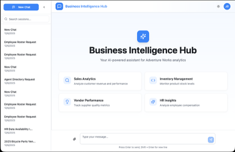
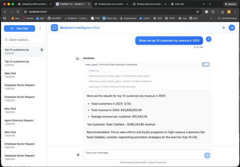
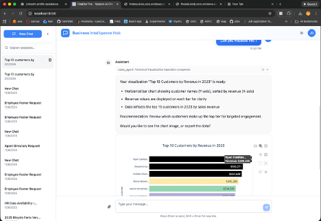

# Adventure Works Analytics System

An AI-powered business intelligence platform built on hierarchical multi-agent architecture. Ask natural language questions about sales, production, purchasing, and HR data to get instant insights and visualizations.

[](https://www.python.org/downloads/)
[](https://reactjs.org/)
[](https://www.typescriptlang.org/)
[](https://azure.microsoft.com/)

> *Built with a vibe-first approach with extensive design, planning and code review*

---

## See It In Action

### Clean, Intuitive Interface
Jump right in with suggested prompts across Sales, Inventory, Vendor, and HR domains.



### Real-Time Streaming Responses
Watch as the AI thinks through your question, coordinates between specialized agents, and delivers insights with full transparency into the reasoning process.



### Interactive Visualizations
Get beautiful, interactive Plotly charts generated on-demand. Hover for details, zoom, pan, and export your insights.



---

## Features

- **Natural Language Queries**: Ask questions in plain English and get data-driven answers
- **Multi-Agent Architecture**: Specialized domain agents for Sales, Production, Purchasing, and HR
- **Interactive Visualizations**: Plotly-powered charts and graphs generated on demand
- **Entity Verification**: Smart validation of customer names, products, vendors, etc.
- **Code Generation**: AI generates and executes SQL/Pandas code safely
- **Session Management**: Maintain conversation context across interactions

## Architecture Overview

```
User Question
     ↓
┌─────────────────────┐
│   Master Agent      │  Routes to appropriate domain
│   (Orchestrator)    │
└─────────┬───────────┘
          ↓
┌─────────┴─────────┐
│   Domain Agents   │  Sales, Production, Purchasing, HR
└─────────┬─────────┘
          ↓
┌─────────┴─────────┐
│ Tech Specialist   │  Generates SQL + Pandas code
└─────────┬─────────┘
          ↓
┌─────────┴─────────┐
│ Plotly Specialist │  Creates visualizations
└─────────┬─────────┘
          ↓
    Results + Insights
```

## Data Source

This project uses the **Adventure Works OLTP** database — Microsoft's sample database for SQL Server, converted to CSV format and imported into SQLite for local development.

### About Adventure Works

Adventure Works is a fictional bicycle manufacturing company. The database contains realistic business data across multiple domains:

| Schema | Description | Example Tables |
|--------|-------------|----------------|
| **Sales** | Orders, customers, territories | SalesOrderHeader, Customer, SalesTerritory |
| **Production** | Products, inventory, work orders | Product, ProductInventory, WorkOrder |
| **Purchasing** | Vendors, purchase orders | Vendor, PurchaseOrderHeader |
| **HumanResources** | Employees, departments | Employee, Department |
| **Person** | Contact information | Person, Address, EmailAddress |

### Setting Up the Database

1. **Download Adventure Works CSV files** from [Microsoft's samples](https://github.com/Microsoft/sql-server-samples/tree/master/samples/databases/adventure-works) or other sources that provide CSV exports

2. **Place CSV files** in `backend/data_stage/data/` directory

3. **Import into SQLite** (first run will auto-create the database):
   ```bash
   cd backend
   python -m data_stage.sqlite_importer
   ```

   This creates `adventureworks.db` with ~60 tables and indexes for optimal query performance.

> **Note**: The CSV data files are not included in this repository due to size. You'll need to obtain them separately.

---
## Quick Start

### Prerequisites

- Python 3.13+
- Node.js 18+
- Azure OpenAI API access (or compatible LLM endpoint)

### Backend Setup

```bash
cd backend

# Create virtual environment
python -m venv venv
source venv/bin/activate  # On Windows: venv\Scripts\activate

# Install dependencies
pip install -r requirements.txt

# Configure environment
cp .env.example .env
# Edit .env with your API credentials

# Run the server
python main.py
```

### Frontend Setup

```bash
cd frontend

# Install dependencies
npm install

# Start development server
npm run dev
```

The application will be available at `http://localhost:5173`

## Project Structure

```
.
├── README.md
├── ARCHITECTURE.md       # Detailed system documentation
├── assets/               # Screenshots for README
│
├── backend/
│   ├── agents/           # AI agent implementations
│   │   ├── agent.py      # Master orchestrator agent
│   │   ├── sales_agent.py
│   │   ├── production_agent.py
│   │   ├── purchasing_agent.py
│   │   └── hr_agent.py
│   ├── tools/            # Code executor, entity verifier, plotly executor
│   ├── routes/           # FastAPI endpoints
│   ├── data_stage/       # SQLite database and data loading
│   ├── cosmosservice/    # Session persistence (optional)
│   ├── utils/            # Helper utilities
│   ├── tests/            # Test suite
│   └── .env.example      # Environment variable template
│
└── frontend/
    ├── src/
    │   ├── components/   # React components
    │   ├── services/     # API client
    │   └── pages/        # Page components
    └── public/           # Static assets
```

## Sample Questions

**Sales:**
- "Show me top 10 customers by revenue"
- "What are the monthly sales trends for 2013?"
- "Compare online vs in-store orders"

**Production:**
- "What products have the highest inventory?"
- "Show work orders by scrap reason"
- "Which products have the lowest manufacturing costs?"

**Purchasing:**
- "Who are our top vendors by purchase volume?"
- "Show purchase orders with delays"
- "What's the average vendor lead time?"

**HR:**
- "Show employee distribution by department"
- "What's the average salary by job title?"
- "List employees hired in the last year"

### Complex Analytical Queries

The system also handles sophisticated multi-step analysis—not just simple lookups.

**Sales Agent:**
- "What are the top 5 sales territories by year-over-year revenue growth?"
- "Which customers have decreased their order volume most in the last 6 months?"
- "Who are our most effective salespeople based on total closed deals?"

**Production Agent:**
- "Which products have the highest inventory turnover rate?"
- "What are the causes of production delays for our top-selling product?"
- "Which manufacturing work orders exceeded their estimated costs?"

**Purchasing Agent:**
- "Which vendors consistently deliver late and affect our supply chain?"
- "What's the average lead time by vendor and how has it changed?"

**HR Agent:**
- "Which departments have the highest turnover?"
- "What's the salary distribution across job titles and tenure?"


## Tech Stack

**Backend:**
- Python 3.13
- FastAPI
- Google ADK (Agent Development Kit)
- SQLite / Pandas / NumPy
- Plotly

**Azure Services:**
- Azure OpenAI (GPT-4 for agent intelligence)
- Azure Cosmos DB (session persistence)
- Azure Blob Storage (file storage & exports)

**Frontend:**
- React 18
- TypeScript
- Vite
- Tailwind CSS
- shadcn/ui

## Documentation

- [Backend Documentation](backend/README.md) - Detailed agent architecture and API reference
- [Architecture Guide](ARCHITECTURE.md) - Complete system overview and data views

## License

See [LICENSE](backend/LICENSE) for details.
